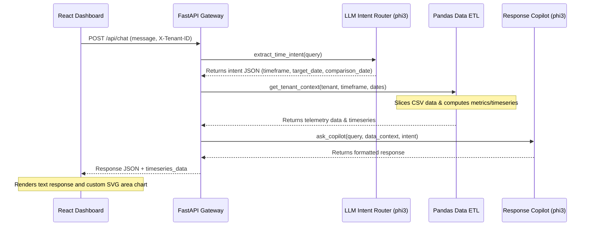

# Cortex Copilot - Intelligent Industrial Energy Gateway

Cortex Copilot is a state-of-the-art multi-tenant energy management copilot designed for industrial factory managers. It pairs local LLM intelligence with dynamic Pandas-based telemetry processing to extract real-time insights, answer timeframe-relative queries, compare historical usage, and push live anomaly alerts.


---

## 🚀 Key Features

*   **Intent Routing Architecture**: Automatically classifies user queries into daily, monthly, comparison, or general timeframe scopes using a timezone-aware local `phi3` routing engine.
*   **Dynamic SVG Chart Visualizations**: Interactive, zero-dependency SVG area charts rendered directly inside chat bubbles for timeseries demand trends (hourly for daily, daily for monthly, and monthly for all-time trends).
*   **Historical Comparisons**: Compares energy metrics and billing deltas across different dates/months (e.g. *"Compare June 2026 peak demand with May 2026"*) and computes percentage shifts on-the-fly.
*   **Context-Aware Suggested Prompts**: Clicking dynamically generated suggestion pills based on active tenant anomalies instantly triggers chat queries.
*   **Proactive WebSocket Alerts**: Pushes live telemetry warnings (such as THD excursions or Power Factor drops) directly into the chat feed using a persistent ASGI WebSocket connection.
*   **Strict Multi-Tenant Isolation**: Enforces query separation, state resets upon tenant switches, and path-normalization logic to guarantee absolute isolation between Tenant A and Tenant B.

---

## ⚙️ Architecture Pipeline

The following sequence diagram outlines the 3-step Intent Routing and Response pipeline:



---

## 🛠️ Installation & Setup

### Prerequisites
- Python 3.10+
- Node.js 18+
- [Ollama](https://ollama.com/) installed and running locally with the `phi3` model loaded:
  ```bash
  ollama run phi3
  ```

### Backend Installation

1. Navigate to the `backend` directory:
   ```bash
   cd backend
   ```
2. Create and activate a virtual environment:
   ```bash
   python -m venv venv
   # On Windows:
   venv\Scripts\activate
   # On Mac/Linux:
   source venv/bin/activate
   ```
3. Install required packages:
   ```bash
   pip install -r requirements.txt
   ```
4. Start the FastAPI backend server:
   ```bash
   uvicorn app.main:app --reload
   ```
   The backend will be running on `http://127.0.0.1:8000`.

### Frontend Installation

1. Navigate to the `frontend` directory:
   ```bash
   cd frontend
   ```
2. Install npm packages:
   ```bash
   npm install
   ```
3. Start the Vite development server:
   ```bash
   npm run dev
   ```
   Open `http://localhost:5173` in your browser to view the dashboard.

---

## 🧪 Running Integration Tests

We have included a comprehensive automated integration test suite that utilizes FastAPI's `TestClient` to validate timeframe routing, dynamic calculations, and security guardrails.

To run the integration tests:
1. Ensure your virtual environment is active in the `backend` folder.
2. Run the test script:
   ```bash
   python tests/test_chatbot.py
   ```
