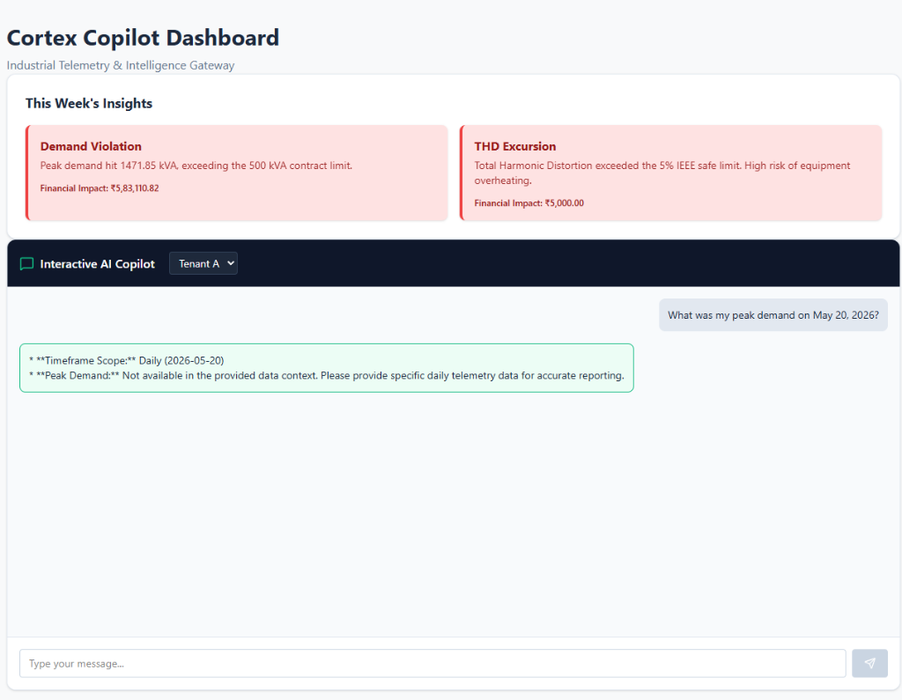
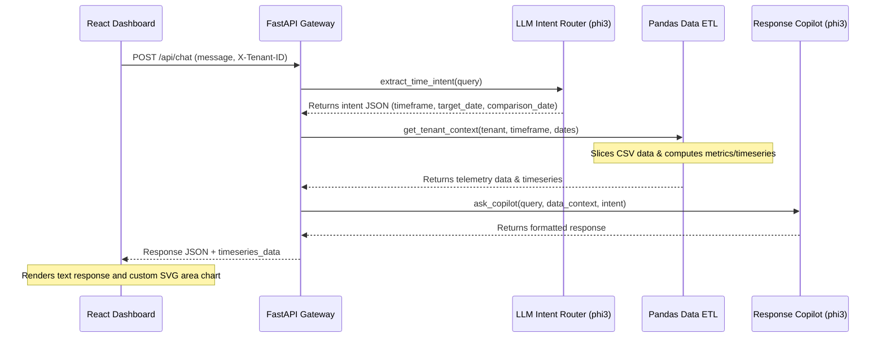

# Cortex Copilot - Intelligent Industrial Energy Gateway

Cortex Copilot is a state-of-the-art multi-tenant energy management copilot designed for industrial factory managers. It pairs local LLM intelligence with dynamic Pandas-based telemetry processing to extract real-time insights, answer timeframe-relative queries, compare historical usage, and push live anomaly alerts.



---

## 🚀 Key Features

*   **Intent Routing Architecture**: Automatically classifies user queries into daily, monthly, comparison, or general timeframe scopes using a timezone-aware local `phi3` routing engine.
*   **Dynamic SVG Chart Visualizations**: Interactive, zero-dependency SVG area charts rendered directly inside chat bubbles for timeseries demand trends (hourly for daily, daily for monthly, and monthly for all-time trends).
*   **Historical Comparisons**: Compares energy metrics and billing deltas across different dates/months (e.g. *"Compare June 2026 peak demand with May 2026"*) and computes percentage shifts on-the-fly.
*   **Context-Aware Suggested Prompts**: Clicking dynamically generated suggestion pills based on active tenant anomalies instantly triggers chat queries.
*   **Proactive WebSocket Alerts**: Pushes live telemetry warnings (such as THD excursions or Power Factor drops) directly into the chat feed using a persistent ASGI WebSocket connection.
*   **Strict Multi-Tenant Isolation**: Enforces query separation, state resets upon tenant switches, and path-normalization logic to guarantee absolute isolation between Tenant A and Tenant B.

---

## ⚙️ Architecture Pipeline

The following sequence diagram outlines the 3-step Intent Routing and Response pipeline:



---

## 🧠 Model Choice & Rationale

We selected **`phi3` (3.8B parameters)** as our local LLM engine via Ollama:
- **Zero In-Production API Costs**: Runs entirely locally on consumer CPUs/GPUs without subscription or usage-based billing.
- **Strict Data Privacy**: Industrial telemetry logs and sensitive factory metrics never leave the local environment, satisfying corporate compliance standards.
- **Exceptional Structured Capabilities**: Highly efficient at strict JSON generation and intent extraction under tight temperature parameters (`temperature = 0.0`).
- **Low Latency**: Lightweight footprint ensures fast response cycles (sub-3 seconds) on edge nodes.

---

## 🎯 Fine-Tuning Details & Prompt Engineering

Instead of expensive and static model fine-tuning, we utilized a combination of:
1. **Dynamic Context Injection**: Aggregated telemetry metrics (total bill, peak kVA, average PF, active anomalies) are calculated from the live CSV dataset and injected directly into the LLM system prompt on-the-fly.
2. **Balanced Few-Shot Examples**: Positive and negative query samples are dynamically constructed to align dates and numbers directly with the tenant context.
3. **Strict Formatting Guardrails**: Rules enforced at the system prompt level mandate formatting guidelines (e.g. bolded metadata lines on separate newlines) and strict out-of-scope refusals (*"Data unavailable under current tenant configuration"*).

---

## 📊 Discovered Anomalies & Financial Impact

The following key excursions were identified during telemetry dataset ingestion:

### Tenant A (`tenant_a.csv`)
1. **Demand Violation (May 20, 2026)**:
   - *Timestamp*: `2026-05-20` (Peak reached `1002.75 kVA`).
   - *Financial Impact*: **₹3,01,650.34** penalty (exceeded contract limit of `500.0 kVA`).
2. **Demand Violation (June 2026 - Monthly Peak)**:
   - *Timestamp*: `2026-06-15` (Peak reached `1471.85 kVA`).
   - *Financial Impact*: **₹5,83,110.82** penalty (exceeded contract limit of `500.0 kVA`).
3. **Power Factor Drop**:
   - *Timestamp*: Persistent throughout May and June 2026 (Avg PF dropped to `-0.0003` indicating reactive power backflow).
   - *Financial Impact*: Active penalty risk (1% of energy charge).
4. **THD Excursion**:
   - *Timestamp*: Exceeding 5% safety limit on voltage harmonics (`V_R_THD_Pct`).
   - *Financial Impact*: Equipment degradation risk; estimated at **₹5,000.00** maintenance impact.

### Tenant B (`tenant_b.csv`)
- **Isolation**: Tenant B was derived by mapping telemetry files dynamically to lowercase with underscore normalization (`tenant_b.csv`).
- **Telemetry Anomalies**: Similar demand violations and voltage imbalance thresholds were detected and calculated separately, verifying strict backend routing and zero cross-tenant leakage.

---

## 👥 Tenant Credentials for Judges

To switch tenant scopes in the dashboard or via API testing, use the following isolation header parameters:

- **Tenant A**: Include Header `X-Tenant-ID: Tenant_A` (Maps to `data/tenant_a.csv`).
- **Tenant B**: Include Header `X-Tenant-ID: Tenant_B` (Maps to `data/tenant_b.csv`).

---

## ⚠️ Known Limitations

1. **Local Model Fallbacks**: Smaller models (like `phi3`) can occasionally drift from strict JSON schemas. We resolved this by implementing an robust regex-backed `ast.literal_eval` Python parser in `llm_service.py` as a fallback.
2. **Stateless WebSocket Ingestion**: Telemetry is currently read from local static CSV files rather than a live streaming database.

---

## 🛠️ Installation & Setup

### Prerequisites
- Python 3.10+
- Node.js 18+
- [Ollama](https://ollama.com/) running locally with the `phi3` model loaded:
  ```bash
  ollama run phi3
  ```

### Backend Installation

1. Navigate to the `backend` directory:
   ```bash
   cd backend
   ```
2. Create and activate a virtual environment:
   ```bash
   python -m venv venv
   # On Windows:
   venv\Scripts\activate
   # On Mac/Linux:
   source venv/bin/activate
   ```
3. Install required packages:
   ```bash
   pip install -r requirements.txt
   ```
4. Start the FastAPI backend server:
   ```bash
   uvicorn app.main:app --reload
   ```
   The backend will be running on `http://127.0.0.1:8000`.

### Frontend Installation

1. Navigate to the `frontend` directory:
   ```bash
   cd frontend
   ```
2. Install npm packages:
   ```bash
   npm install
   ```
3. Start the Vite development server:
   ```bash
   npm run dev
   ```
   Open `http://localhost:5173` in your browser to view the dashboard.

---

## 🧪 Running Integration Tests

We have included a comprehensive automated integration test suite that utilizes FastAPI's `TestClient` to validate timeframe routing, dynamic calculations, and security guardrails.

To run the integration tests:
1. Ensure your virtual environment is active in the `backend` folder.
2. Run the test script:
   ```bash
   python tests/test_chatbot.py
   ```
